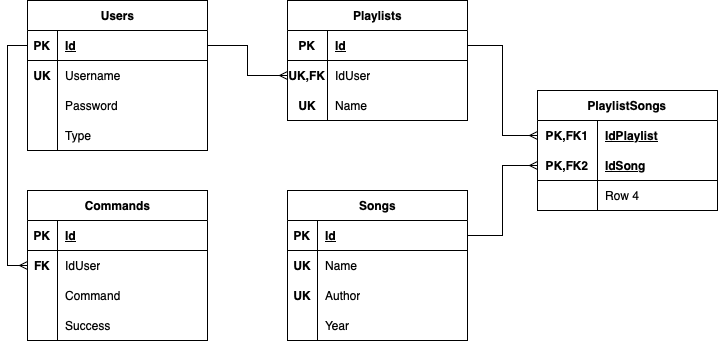

# Audio_Library

## Overview
A Java-based application that allows users to create and store songs and playlists through a command line interface.

## Features
- Multiple types of users;
- Authentication and authorization;
- Create songs and playlists;
- Add songs to a playlist;
- Search a song;
- Paging system;
- Export and import system;
- Audit system: store all the commands given by users.

## Database diagram

## A very simplified view of the application structure

## Types of users
- Anonymous: Users who have not gone through a login step. Their access is limited to login and registration commands;
- Authenticated: Users who have an account and their access consists in basic functions: create playlists, add songs to playlists, etc.;
- Admin: Users who have an account and access to all commands.

## Commands
### Help
- Syntax: `help`
- Description: Prints all the available commands for the user of the current session;
- Users: Anonymous, Authenticated, Admin
### Quit
- Syntax: `quit`
- Description: Stop the app running;
- Users: Anonymous, Authenticated, Admin
### Register
- Syntax: `register "username" "password"`
- Description: Register a new user and be authenticated as him;
- Users: Anonymous
### Login
- Syntax: `login "username" "password"`
- Description: Login to your account;
- Users: Anonymous
### Logout
- Syntax: `logout`
- Description: Logout from your account;
- Users: Authenticated, Admin
### Promote
- Syntax: `promote "username"`
- Description: Make user "username" an admin;
- Users: Admin
### Create song
- Syntax: `create song "songName" "authorName" year`
- Description: Add a song to the app's audio library;
- Users: Admin
### Create playlist
- Syntax: `create playlist "playlistName"`
- Description: Create a playlist named "playlistName" if it does not exist;
- Users: Authenticated, Admin
### Add song to a playlist
- Syntax: `add (byName/byId) ("playlistName"/playlistId) songId [song2Id song3Id ...]`
- Description: Add a song or a list of songs by their ids in a playlist after his name or id. Command fails if at least one song fails to be added;
- Users: Authenticated, Admin
### List playlists
- Syntax: `list playlists [pageNumber]`
- Description: List all the playlists of the current user. Page number is by default 1;
- Users: Authenticated, Admin
### Search song
- Syntax: `search (author/name) "searchCriteria" [pageNumber]`
- Description: Search and print all the songs that have at least a match with the "searchCriteria". Page number is by default 1;
- Users: Authenticated, Admin
### Export playlist
- Syntax: `export playlist ("playlistName"/playlistId) (format)`
- Description: Export the playlist into a file named "export_username_playlistName_date.extension". The accepted formats are: json, csv, personal;
- Users: Authenticated, Admin
### Import playlist
- Syntax: `import playlist "absolutPathOfFile"`
- Description: Import a playlist of songs from a file that have one of these formats: json, csv, txt. For the .txt extension, the format is personal;
- Users: Authenticated, Admin
### Audit
- Syntax: `audit "username" [pageNumber]`
- Description: List all the commands given by the user "username". Page number is by default 1;
- Users: Admin
### Redo
- Syntax: `redo commandId`
- Description: Reuse a command;
- Users: Admin

## Examples
Check the [examples](./examples) folder to see some uses of the above commands.

## More about Paging and Export/Import systems

- Paging:
  - The default number of elements per page is 5. To change it you must modify the file.(TODO: command to allow user to modify it)
  - For the commands that have paging system you have to put the page index (if not, it will be considered the default). Even if it is the first time when you call that command, you can add the page index to the command.(TODO: maybe a cache system would be nice)
- Export:
  - The accepted formats are: json, csv, personal(.txt)
  - I had to put some methods even I do not use them so the used libraries (for json and csv formats) would work well
  - To export an object in csv format, that object must contain a list. In this code, I exported an object with a field playlistName and a list of songs. In the file will be only the list of songs, the playlistName field is inserted in the file name only.
- Import:
  - The accepted file extensions are json, csv and txt. For the txt file, the format should be in the same style as personal
  - I had to put some methods even I do not use them here aswell (for the same reason)
  - In this code, when importing from csv file, the playlistName field will be the name of the file
  - To work well and get some data from importing, please try to respect the format as much as possible. If you do not know how the formats look, try to export some data or check the [formats](./formats) folder.

