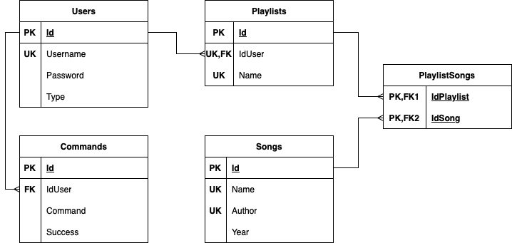

# Audio_Library

## Overview
A Java-based application that allows users to create and store songs and playlists through a command line interface.

## Features
- Multiple types of users;
- Authentication and authorization;
- Create songs and playlists;
- Add songs to a playlist;
- Search a song;
- Paging system;
- Export and import system;
- Audit system: store all the commands given by users.

## Database diagram

## Types of users
- Anonymous: Users who have not gone through a login step. Their access is limited to login and registration commands;
- Authenticated: Users who have an account and their access consists in basic functions: create playlists, add songs to playlists, etc.;
- Admin: Users who have an account and access to all commands.

## Commands
### Help
- Syntax: `help`
- Description: Prints all the available commands for the user of the current session;
- Users: Anonymous, Authenticated, Admin
### Quit
- Syntax: `quit`
- Description: Stop the app running;
- Users: Anonymous, Authenticated, Admin
### Register
- Syntax: `register "username" "password"`
- Description: Register a new user and be authenticated as him;
- Users: Anonymous
### Login
- Syntax: `login "username" "password"`
- Description: Login to your account;
- Users: Anonymous
### Logout
- Syntax: `logout`
- Description: Logout from your account;
- Users: Authenticated, Admin
### Promote
- Syntax: `promote "username"`
- Description: Make user "username" an admin;
- Users: Admin
### Create song
- Syntax: `create song "songName" "authorName" year`
- Description: Add a song to the app's audio library;
- Users: Admin
### Create playlist
- Syntax: `create playlist "playlistName"`
- Description: Create a playlist named "playlistName" if it does not exist;
- Users: Authenticated, Admin
### Add song to a playlist
- Syntax: `add (byName/byId) ("playlistName"/playlistId) songId [song2Id song3Id ...]`
- Description: Add a song or a list of songs by their ids in a playlist after his name or id. Command fails if at least one song fails to be added;
- Users: Authenticated, Admin
### List playlists
- Syntax: `list playlists [pageNumber]`
- Description: List all the playlists of the current user. Page number is by default 1;
- Users: Authenticated, Admin
### Search song
- Syntax: `search (author/name) "searchCriteria" [pageNumber]`
- Description: Search and print all the songs that have at least a match with the "searchCriteria". Page number is by default 1;
- Users: Authenticated, Admin
### Export playlist
- Syntax: `export playlist ("playlistName"/playlistId) (format)`
- Description: Export the playlist into a file named "export_username_playlistName_date.extension". The accepted formats are: json, csv, personal;
- Users: Authenticated, Admin
### Import playlist
- Syntax: `import playlist "absolutPathOfFile"`
- Description: Import a playlist of songs from a file that have one of these formats: json, csv, txt. For the .txt extension, the format is personal;
- Users: Authenticated, Admin
### Audit
- Syntax: `audit "username" [pageNumber]`
- Description: List all the commands given by the user "username". Page number is by default 1;
- Users: Admin
### Redo
- Syntax: `redo commandId`
- Description: Reuse a command;
- Users: Admin

## Examples
Check the [examples](./examples) folder to see some uses of the above commands.

